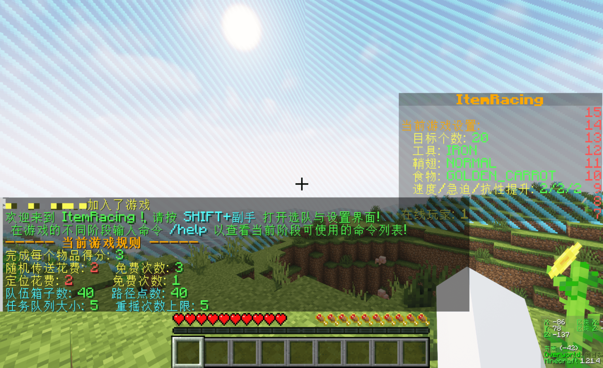
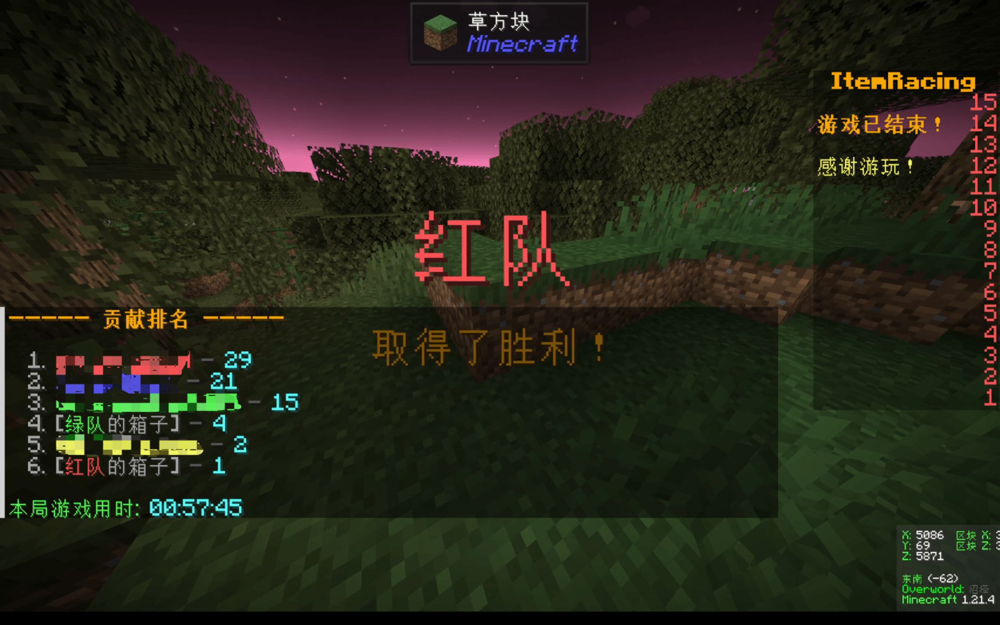

# ItemRacing

灵感和玩法**直接来源**于 [LQSnow](https://github.com/LQSnow/) 的 [BlockRacing](https://github.com/LQSnow/BlockRacing), 向他的创意表示感谢.

___

这是一个 Minecraft 小游戏插件, 玩家分组竞速收集物品, 先完成指定物品数的队伍获胜.

Minecraft 版本: Java `1.21.X`. 服务端: `paper` 及其衍生版本. 游戏人数: `1+`.

> [!WARNING]
> 作者不会 Java , 该项目 90% 以上代码由 Gemini 2.5 Pro 生成, 且插件的所有功能未经充分测试, 插件能运行的环境也未经测试, 作者仅在 `1.21.4` 的 `paper` 服务端上测试了游戏基本功能. 不保证插件的稳定性.

## Screenshots






## 游玩流程

在**准备阶段**和**游戏阶段**, 玩家都可使用 `潜行 + 副手` 打开**游戏菜单**.

1. 准备阶段, 玩家在游戏菜单自由选择队伍, 修改局内游戏设置, 所有人都准备好后即可开始游戏. (1 个人也可以玩.)
2. 游戏阶段, 玩家需收集指定物品, 目标物品会展示于计分板. 玩家可通过游戏菜单或命令提供的功能辅助收集.
3. 允许在游戏开始后, 未加入队伍的玩家加入队伍进行游戏.
4. 游戏结束后, 服务器所有者需手动重启服务器、删除地图文件夹以重置地图.

## 命令列表

在不同游戏阶段, 玩家均可用 `/help` 命令查看当前可用命令列表.

### 准备阶段

| 命令 | 功能 |
| :---: | :---: |
| /join <队伍名> | 加入队伍 |
| /leave | 离开队伍 |
| /start | 开始游戏 |

### 游戏阶段

|                命令                | 功能 |
|:--------------------------------:| :---: |
|             /locate              | 消耗队伍定位次数, 定位群系或结构. 使用次数可在游戏菜单中购买 |
|               /tpr               | 消耗队伍积分, 在**主世界**随机传送 |
|          /chest \<num>           | 打开第 `num` 个队伍箱子 |
|           /box \<num>            | 同 /chest |
|               /wp                | 打开路径点菜单 |
|             /tp <队友>             | 传送到队友 |
|            /pc \<消息>             | 队伍聊天 |
|          /teammsg \<消息>          | 同 /pc |
| /sb <ranking \| watch \| rotate> | 切换计分板样式 |
|              /roll               | 申请重摇任务物品 |
|           /join <队伍名>            | 未加入队伍的玩家可在游戏开始后加入游戏 |

### 结束阶段

|         命令          | 功能 |
|:-------------------:| :---: |
| /itemracing:restart | 重启服务器

## 规则设置

### 基本规则

服务器所有者可通过配置文件 `config.yml` 修改以下基本游戏规则:

```yaml
# 队伍名称及颜色
teams:
  red:
    display-name: "§c红队"
    color: "#FF5555"
  blue:
    display-name: "§9蓝队"
    color: "#5555FF"
  green:
    display-name: "§a绿队"
    color: "#55FF55"
  yellow:
    display-name: "§e黄队"
    color: "#FFFF55"

# 是否为每位玩家解锁全配方
unlock-all-recipes: true

# 定位花费
locate-cost: 3

# 随机传送花费
tpr-cost: 2

# 定位命令可免费使用次数
initial-locate-uses: 1

# 随机传送命令可免费使用次数
initial-tpr-uses: 3


# 团队箱子数量
team-chest-amount: 40

# 团队路径点数量
team-waypoint-amount: 40

# 任务队列大小
task-queue-size: 5

# 默认目标物品数, 可在游戏设置中更改
items-to-collect: 20

# 收集每个物品的得分
score-per-item: 3

# 队伍可 roll 次数
max-rolls-per-team: 5
```

### 局内规则

玩家可在游戏开始前设置（加粗表示默认值）:

1. 任务物品数量 [默认 **20**]
2. 开局工具(镐斧铲) [无, 石质, **铁质**]
3. 开局鞘翅 [无, 损坏, **正常**]
4. 开局食物 [无, **金胡萝卜**, 饱和]
5. 速度等级 [1~5, 默认 **2**]
6. 急迫等级 [1~5, 默认 **2**]
7. 抗性提升等级 [1~5, 默认 **2**]
8. 是否给予以下附魔书: [**经验修补**, **精准采集**, 时运Ⅲ, 抢夺Ⅲ]

## 物品列表

玩家要收集的物品从所有生存可获取的物品中随机抽取, 含 NBT 标签和作者主观认为极难获取的物品已被排除, 被排除的物品如下:

### 含 NBT 标签的物品:

- 所有药水
- 所有药水箭
- 所有附魔书
- 迷之炖菜, 成书, 地图, 烟花火箭, 烟火之星

### 极难获取的物品:

- 所有纹样陶片
- 所有音乐唱片
- 所有锁链装备
- 所有锻造模板
- 所有虫蚀方块
- 除凋零骷髅头外的所有生物头颅
- 深层煤炭矿石, 深层绿宝石矿石
- 鹦鹉壳, 潮涌核心
- 下界合金块
- 龙蛋, 龙息
- 沉重核心, 重锤, 三叉戟
- 下界之星, 信标, 凋零玫瑰
- 不死图腾
- 所有蛙明灯
- 火把花, 瓶子草, 瓶子草荚果, 嗅探兽蛋, 可疑的沙子, 可疑的沙砾
- 地球旗帜图案, 涡流旗帜图案, 旋风旗帜图案, 猪鼻旗帜图案, 苦力怕盾徽旗帜图案

这只是初步的过滤, 如有需要补充的物品, 可提出 Issue, 或修改 `ItemManager.java` 中相应的过滤部分并 PR.

## 如何使用

有开服经验的话就不用看这部分了, 否则认真看.

### 准备服务器

这里以 `Windows 系统`、`paper` 为例.

前往 [papermc 官网](https://papermc.io/downloads/all) 下载对应版本的服务器核心, 把下载的 `.jar` 移到一个空文件夹中.

在该文件夹处打开终端 (或自行 `cd` 进该目录), 执行:

```powershell
java -jar *.jar
# *.jar 是你下载的服务器核心文件名
```

在看到这样的输出后:

```
[16:58:46 WARN]: Failed to load eula.txt
[16:58:47 INFO]: You need to agree to the EULA in order to run the server. Go to eula.txt for more info.
```

打开同目录下的 `eula.txt`, 把最后一行的 `eula=false` 改成 `eula=true`.

在该目录下新建一个 `start.bat` 批处理文件, 写入如下内容并保存:

```
rd /s /q world
rd /s /q world_nether
rd /s /q world_the_end
java -Xmx4G -Xms4G -jar 你的jar完整文件名 nogui
```

上面的 `4G` 是分配的内存大小, 按你的实际情况进行调整.

以后就可以通过执行 `start.bat` 启动服务器了.

### 安装插件

从 [Releases页](https://github.com/Coast23/ItemRacing/releases) 下载 `ItemRacing-x.x.jar`, 把它放到服务器的 `plugins` 文件夹中.

首次启动服务器后, 会生成 `plugins/ItemRacing/config.yml`, 可根据自己的需求进行配置.

### 重启服务器

使用该功能需要将 `start.sh` 修改为:

* Windows:

```powershell
@echo off
:start

rd /s /q world
rd /s /q world_nether
rd /s /q world_the_end
java -Xmx4G -Xms4G -jar 你的jar完整文件名 nogui

echo.
echo echo Server will restart in 5 seconds... Press Ctrl+C to cancel.
timeout /t 5
goto start
```

* Linux:

```shell
#!/bin/bash

while true
do
    rm -rf world
    rm -rf world_nether
    rm -rf world_the_end
    java -Xmx4G -Xms4G -jar 你的jar完整文件名 nogui
    
    echo "Server will restart in 5 seconds... Press Ctrl+C to cancel."
    sleep 5
done
```